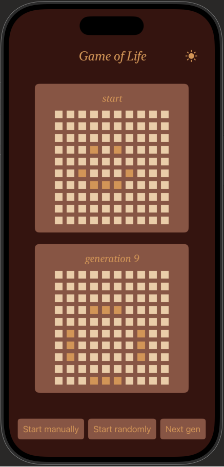
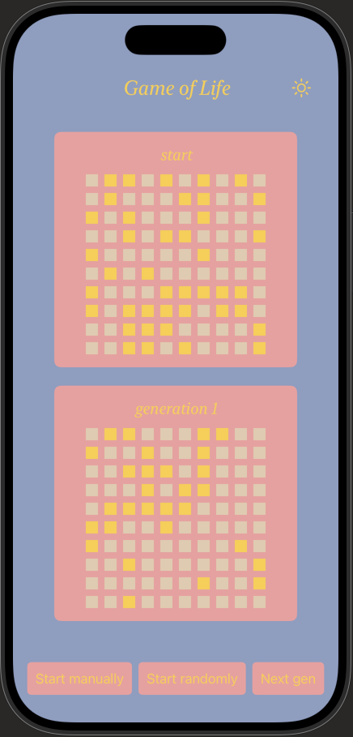

# Game_of_Life

This project is an implementation of Conway's Game of Life that i did during my studies as a first introduction to Swift
I have now reworked it a bit and added some features as well as a new design

## Rules
Every cell interacts with its eight neighbours, which are the cells that are horizontally, vertically, or diagonally adjacent. At each step in time, the following transitions occur:
- Any live cell with fewer than two live neighbours dies, as if by underpopulation.
- Any live cell with two or three live neighbours lives on to the next generation.
- Any live cell with more than three live neighbours dies, as if by overpopulation.
- Any dead cell with exactly three live neighbours becomes a live cell, as if by reproduction.

https://en.wikipedia.org/wiki/Conway%27s_Game_of_Life#

## Features
- light/darkmode
- option to place the living cells manually on the startig board
- button to evolve to the next generation
- option to place living cells randomly on the starting board

below you can see a few screenshots from the game.
1. random start generation with the first generation
2. the view for the manual start (I wanted the board to be bigger so it actually works to tap the cells on the phone)
3. the manual start a few generations deep
4. light mode

   
   
  
